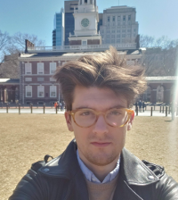

I'm an Analytical Linguist at Grammarly where I think about ethics and fairness in AI.

I obtained my PhD in Linguistics from Harvard University in May 2021. My PhD research broadly concerned semantics, pragmatics, and language change and how these things can be modeled computationally. Slightly more specifically, I worked on the semantics and diachrony of pluractionality and aspect, and the syntax and semantics of concessive clauses. You can read more about my research on the [Research page](/research.html). I am a former member of the [Meaning and Modality Lab](https://projects.iq.harvard.edu/meaningandmodality/home) at Harvard Linguistics.

Prior to the PhD, I graduated from Boston College with a BA in Linguistics and Philosophy, where I completed a thesis examining the metaphysics of normativity and the context-sensitivity of normative statements. I am originally from Kansas City, Missouri. Beyond academics, you can find me listening, making, and DJing experimental music or watching Kansas City Royals baseball.

You can reach me via email at <gunnarlund@g.harvard.edu>. You can also find me on [github](https://github.com/gunnarnl).
